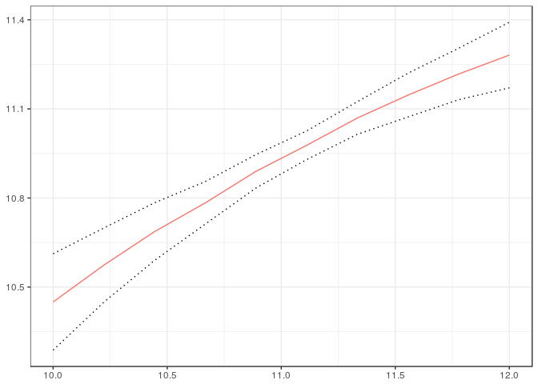

<!-- README.md is generated from README.Rmd. Please edit that file -->
cfa
===

The cfa package contains methods for computing counterfactuals with a continuous treatment variable. In particular, the package can be used to calculate the expected value, the variance, the interquantile range, the fraction of observations below or above a particular cutoff, or other user-supplied functions of an outcome of interest conditional on a continuous treatment. The package can also be used for computing these same functionals after adjusting for differences in covariates at different values of the treatment. Further, one can use the package to conduct uniform inference for each parameter of interest across all values of the treatment, uniformly test whether adjusting for covariates makes a difference at any value of the treatment, and test whether a parameter of interest is different from its average value at an value of the treatment.

Installation
------------

You can install cfa from github with:

``` r
# install.packages("devtools")
devtools::install_github("WeigeHuangEcon/cfa")
#> Downloading GitHub repo WeigeHuangEcon/cfa@master
#> from URL https://api.github.com/repos/WeigeHuangEcon/cfa/zipball/master
#> Installing cfa
#> Installing tidyr
#> Installing dplyr
#> Installing BH
#> '/usr/lib/R/bin/R' --no-site-file --no-environ --no-save --no-restore  \
#>   --quiet CMD INSTALL '/tmp/RtmpDeN41W/devtools32bc62a95ca9/BH'  \
#>   --library='/home/brant/R/x86_64-pc-linux-gnu-library/3.4'  \
#>   --install-tests
#> 
#> Installing glue
#> '/usr/lib/R/bin/R' --no-site-file --no-environ --no-save --no-restore  \
#>   --quiet CMD INSTALL '/tmp/RtmpDeN41W/devtools32bc69d7f96a/glue'  \
#>   --library='/home/brant/R/x86_64-pc-linux-gnu-library/3.4'  \
#>   --install-tests
#> 
#> Installing Rcpp
#> '/usr/lib/R/bin/R' --no-site-file --no-environ --no-save --no-restore  \
#>   --quiet CMD INSTALL '/tmp/RtmpDeN41W/devtools32bc21b03cba/Rcpp'  \
#>   --library='/home/brant/R/x86_64-pc-linux-gnu-library/3.4'  \
#>   --install-tests
#> 
#> Installing rlang
#> '/usr/lib/R/bin/R' --no-site-file --no-environ --no-save --no-restore  \
#>   --quiet CMD INSTALL '/tmp/RtmpDeN41W/devtools32bc2850461a/rlang'  \
#>   --library='/home/brant/R/x86_64-pc-linux-gnu-library/3.4'  \
#>   --install-tests
#> 
#> '/usr/lib/R/bin/R' --no-site-file --no-environ --no-save --no-restore  \
#>   --quiet CMD INSTALL '/tmp/RtmpDeN41W/devtools32bc2dc10c52/dplyr'  \
#>   --library='/home/brant/R/x86_64-pc-linux-gnu-library/3.4'  \
#>   --install-tests
#> 
#> Skipping install of 'glue' from a cran remote, the SHA1 (1.2.0) has not changed since last install.
#>   Use `force = TRUE` to force installation
#> Installing purrr
#> '/usr/lib/R/bin/R' --no-site-file --no-environ --no-save --no-restore  \
#>   --quiet CMD INSTALL '/tmp/RtmpDeN41W/devtools32bc768c28c0/purrr'  \
#>   --library='/home/brant/R/x86_64-pc-linux-gnu-library/3.4'  \
#>   --install-tests
#> 
#> Skipping install of 'Rcpp' from a cran remote, the SHA1 (0.12.13) has not changed since last install.
#>   Use `force = TRUE` to force installation
#> Skipping install of 'rlang' from a cran remote, the SHA1 (0.1.4) has not changed since last install.
#>   Use `force = TRUE` to force installation
#> Installing tidyselect
#> '/usr/lib/R/bin/R' --no-site-file --no-environ --no-save --no-restore  \
#>   --quiet CMD INSTALL '/tmp/RtmpDeN41W/devtools32bc5f7e65af/tidyselect'  \
#>   --library='/home/brant/R/x86_64-pc-linux-gnu-library/3.4'  \
#>   --install-tests
#> 
#> '/usr/lib/R/bin/R' --no-site-file --no-environ --no-save --no-restore  \
#>   --quiet CMD INSTALL '/tmp/RtmpDeN41W/devtools32bc52a1daa5/tidyr'  \
#>   --library='/home/brant/R/x86_64-pc-linux-gnu-library/3.4'  \
#>   --install-tests
#> 
#> '/usr/lib/R/bin/R' --no-site-file --no-environ --no-save --no-restore  \
#>   --quiet CMD INSTALL  \
#>   '/tmp/RtmpDeN41W/devtools32bc413eb4f3/WeigeHuangEcon-cfa-757c046'  \
#>   --library='/home/brant/R/x86_64-pc-linux-gnu-library/3.4'  \
#>   --install-tests
#> 
```

or from CRAN using

``` r
install.packages("cfa")
```

Usage
-----

The following example shows how to estimate the counterfactual distribution of child's income as a function of parent's income, as well as some additional parameters that depend on this distribution.

``` r
library(cfa)
#> 
#> Attaching package: 'cfa'
#> The following object is masked from 'package:stats':
#> 
#>     IQR
data(igm)
tvals <- seq(10,12,length.out=10)
yvals <- seq(quantile(igm$lcfincome, .05), quantile(igm$lcfincome, .95), length.out=50)
## This line doesn't adjust for any covariates
obs.dist <- cfa(lcfincome ~ lfincome, tvals=tvals, yvals=yvals, data=igm, iters=25)
#> boostrapping standard errors...

## This line adjusts for differences in education
cf.dist <- cfa(lcfincome ~ lfincome, ~HEDUC, tvals=tvals, yvals=yvals, data=igm, iters=25)
#> boostrapping standard errors...
class(cf.dist)
#> [1] "CFA"
attributes(cf.dist)
#> $names
#> [1] "tvals"        "distcondt"    "bootiterlist" "tvallist"    
#> [5] "coef"        
#> 
#> $class
#> [1] "CFA"
```

The objects that are returned from the `cfa` method are (most of the time) too complicated to directly understand, as they are distribution function for every value of \(t\). Instead, the `getRes.CFA` method can be used to obtain particular results from a CFA object. Here is an example

``` r
cf.e <- getRes.CFA(cf.dist, fun=E, se=T)
```

The parameter `fun` in the `getRes.CFA` function accepts any function that can be applied to a distribution function and return a single number (additional parameters that the function needs can be passed through the `...` argument). In the example above, `E` is computes the expectation given a distribution function -- this function is supplied in the package. Besides `E`, functions for computing the variance, inter-quantile range, the fraction of individuals below the poverty line, and the fraction of individuals who are "rich" -- these are called `Var`, `IQR`, `pov`, and `rich`. But other custom functions could be developed by users.

These types of results are simple to plot as function of \(t\). The `cfa` packages implements plotting mechanisms using `ggplot2`.

``` r
ggplot2.CFA(cf.e)
```


