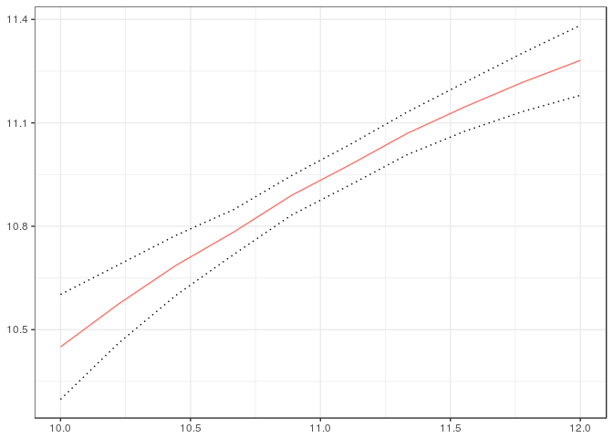
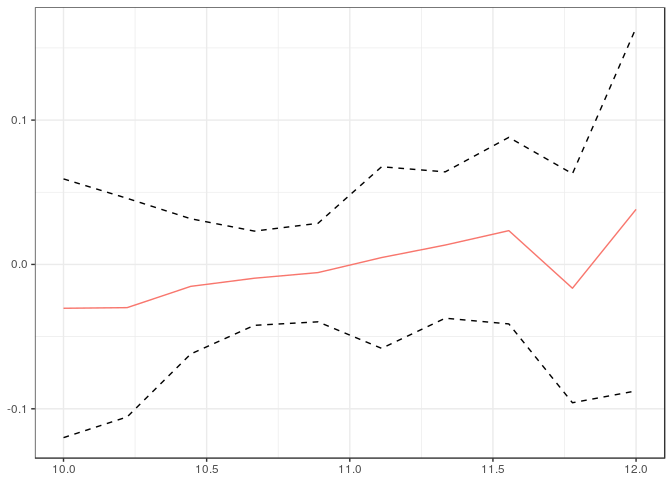
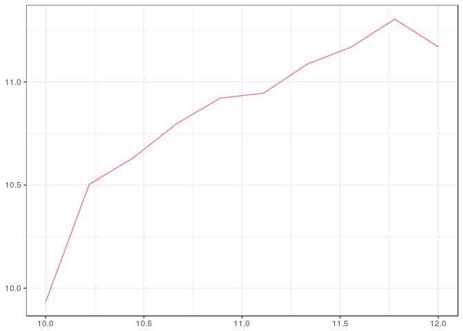

<!-- README.md is generated from README.Rmd. Please edit that file -->
ccfa
====

The `ccfa` package contains methods for computing counterfactuals with a continuous treatment variable. In particular, the package can be used to calculate the expected value, the variance, the interquantile range, the fraction of observations below or above a particular cutoff, or other user-supplied functions of an outcome of interest conditional on a continuous treatment. The package can also be used for computing these same functionals after adjusting for differences in covariates at different values of the treatment. Further, one can use the package to conduct uniform inference for each parameter of interest across all values of the treatment, uniformly test whether adjusting for covariates makes a difference at any value of the treatment, and test whether a parameter of interest is different from its average value at an value of the treatment.

Installation
------------

You can install `ccfa` from github with:

``` r
# install.packages("devtools")
devtools::install_github("WeigeHuangEcon/ccfa")
#> Skipping install of 'ccfa' from a github remote, the SHA1 (356e921f) has not changed since last install.
#>   Use `force = TRUE` to force installation
```

or from CRAN using

``` r
install.packages("ccfa")
```

Usage
-----

The following example shows how to estimate the counterfactual distribution of child's income as a function of parent's income, as well as some additional parameters that depend on this distribution.

``` r
library(ccfa)
#> 
#> Attaching package: 'ccfa'
#> The following object is masked from 'package:stats':
#> 
#>     IQR
data(igm)
tvals <- seq(10,12,length.out=10)
yvals <- seq(quantile(igm$lcfincome, .05), quantile(igm$lcfincome, .95), length.out=50)
## This line doesn't adjust for any covariates
obs.dist <- cfa(lcfincome ~ lfincome, tvals=tvals, yvals=yvals, data=igm, iters=25)
#> boostrapping standard errors...

## This line adjusts for differences in education
cf.dist <- cfa(lcfincome ~ lfincome, ~HEDUC, tvals=tvals, yvals=yvals, data=igm, iters=25)
#> boostrapping standard errors...
class(cf.dist)
#> [1] "CFA"
attributes(cf.dist)
#> $names
#> [1] "tvals"        "distcondt"    "bootiterlist" "tvallist"    
#> [5] "coef"        
#> 
#> $class
#> [1] "CFA"
```

The objects that are returned from the `cfa` method are (most of the time) too complicated to directly understand, as they are distribution function for every value of \(t\). Instead, the `getRes.CFA` method can be used to obtain particular results from a CFA object. Here is an example

``` r
cf.e <- getRes.CFA(cf.dist, fun=E, se=T)
```

The parameter `fun` in the `getRes.CFA` function accepts any function that can be applied to a distribution function and return a single number (additional parameters that the function needs can be passed through the `...` argument). In the example above, `E` is computes the expectation given a distribution function -- this function is supplied in the package. Besides `E`, functions for computing the variance, inter-quantile range, the fraction of individuals below the poverty line, and the fraction of individuals who are "rich" -- these are called `Var`, `IQR`, `pov`, and `rich`. But other custom functions could be developed by users.

These types of results are simple to plot as function of \(t\). The `ccfa` packages implements plotting mechanisms using `ggplot2`.

``` r
ggplot2.CFA(cf.e)
```



Next, we include an example where quantile regression is used in the first step to estimate the conditional conditional distribution. The following code estimates two counterfactual distributions using first-step quantile regression. The first one does not include any covariates (so the counterfactual distribution is the observed distribution); the second includes the head of the household's education as a covariate.

``` r
library(quantreg)
#> Loading required package: SparseM
#> 
#> Attaching package: 'SparseM'
#> The following object is masked from 'package:base':
#> 
#>     backsolve
out <- cfa2(lcfincome ~ lfincome, tvals, yvals, igm, method1="qr", xformla2=~HEDUC, method2="qr", iters=25, tau1=seq(.05,.95,.05), tau2=seq(.05,.95,.05))
#> boostrapping standard errors...
```

Joint estimation allows one to test if the results are the same whether or not covariates are included. To do this we can run the following code which produces uniform confidence bands on the difference between the two sets of results. Because the bands are uniform, one can reject that child's income depends on parents' income if the result is statistically different from 0 anywhere.

``` r
ggplot2.CFA(getResDiff.CFA(out$cfa1, out$cfa2, E), setype="uniform")
```



As another example, we can test if the variance of child's income changes with parents' income. The following code plots uniform confidence bands for the difference between the variance of child's income conditional on parent's income and the average variance (averaged over parent's income).

``` r
ggplot2.CFA(test.CFA(out$cfa1, Var, igm$lfincome), setype="uniform")
```


As a final example, we show how to compute counterfactual distributions using local linear regression. The computation is a bit slower, so we do not plot standard errors here.

``` r
llres <- cfa(lcfincome ~ lfincome, ~HEDUC, tvals=tvals, yvals=yvals, method="ll", se=FALSE, data=igm)
#> [1] "computing local linear distribution regression"
```

``` r
ggplot2.CFA(getRes.CFA(llres, E, se=FALSE))
```


